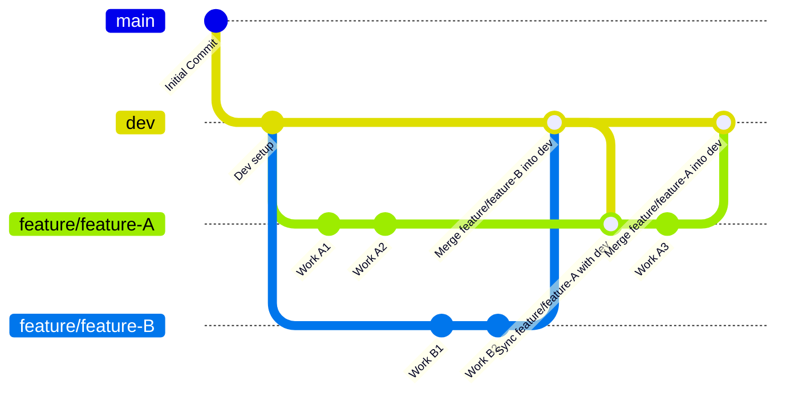

# Git Team Workflow: Feature Branch Strategy

> **Branch Naming Suggestions & Warnings**
>
> - **Do not** create feature branch names using your own name or the word `dev`.
> - Use the format: `feature/clear-feature-name` (e.g., `feature/langgraph-agent`).
> - The branch name should clearly describe the feature being developed.
> - Once your feature is merged into `dev`, you can safely delete your feature branch locally and remotely.
> - There is **no need** to push your feature branch to GitHub unless collaboration or code review is required.

## Overview

This workflow ensures all team members:
- Start from the latest `dev` branch
- Work on isolated features
- Keep feature branches in sync with `dev`
- Cleanly merge back to `dev` after review

---

## Branch Flow Diagram



## Team should follow

- Create a new feature branch
```bash
git checkout dev
git pull origin dev
git checkout -b feature/my-feature
```
- Work on your feature branch
```bash
git add .
git commit -m "Implemented part of feature"
```
- Keep your feature branch updated with latest dev

Do this regularly and before merging:

```bash
git checkout dev
git pull origin dev
git checkout feature/my-feature
git merge dev
```
- Merge your feature branch into dev
```bash
git checkout dev
git pull origin dev
git merge feature/my-feature
git push origin dev
```

- Continue working on your feature branch
```bash
git checkout dev
git pull origin dev
git checkout feature/my-feature
git merge dev
```

# Git Alias: syncdev

This alias allows you to quickly synchronize your current feature branch with the latest changes from the `dev` branch.  

**Usage:**  
## Quick Git Alias: `syncdev`

You can add this handy alias to your global git config to quickly sync your feature branch with the latest `dev` changes:

```bash
git config --global alias.syncdev '!f() { git checkout dev && git pull origin dev && git checkout $1 && git merge dev; }; f'
```

**Usage Example:**

Suppose you are working on a branch called `feature/components`. To sync it with the latest `dev`:

```bash
git syncdev feature/feature-A
```

This will:
1. Switch to `dev`
2. Pull the latest changes from `origin/dev`
3. Switch back to your feature branch
4. Merge `dev` into your feature branch

---
