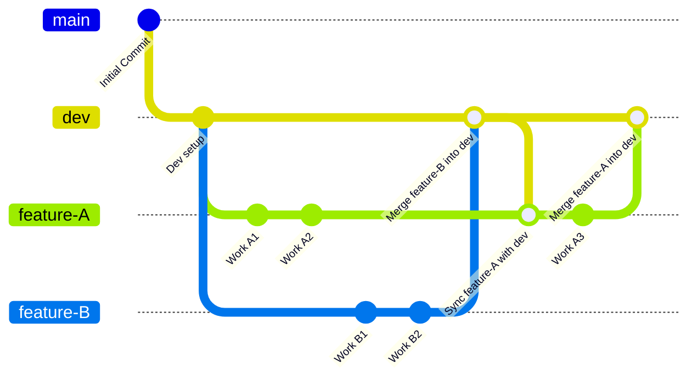

# 🧪 Git Team Workflow: Feature Branch Strategy

## 📌 Overview

This workflow ensures all team members:
- Start from the latest `dev` branch
- Work on isolated features
- Keep feature branches in sync with `dev`
- Cleanly merge back to `dev` after review

---

## Branch Flow Diagram



## Team should follow

- Create a new feature branch
```bash
git checkout dev
git pull origin dev
git checkout -b feature/my-feature
```
- Work on your feature branch
```bash
git add .
git commit -m "Implemented part of feature"
```
- Keep your feature branch updated with latest dev

Do this regularly and before merging:

```bash
git checkout dev
git pull origin dev
git checkout feature/my-feature
git merge dev
```
- Merge your feature branch into dev
```bash
git checkout dev
git pull origin dev
git merge feature/my-feature
git push origin dev
```

- Continue working on your feature branch
```bash
git checkout dev
git pull origin dev
git checkout feature/my-feature
git merge dev
```
